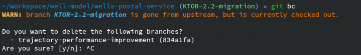

# git-branch-cleanup



Small cli that prints out the branches that have been merged and offers to delete them.

```shell
cargo install --git https://github.com/sighol/git-branch-cleanup
```

Then you can run this command in the root directory of your git repository
```
git branch-cleanup
```


